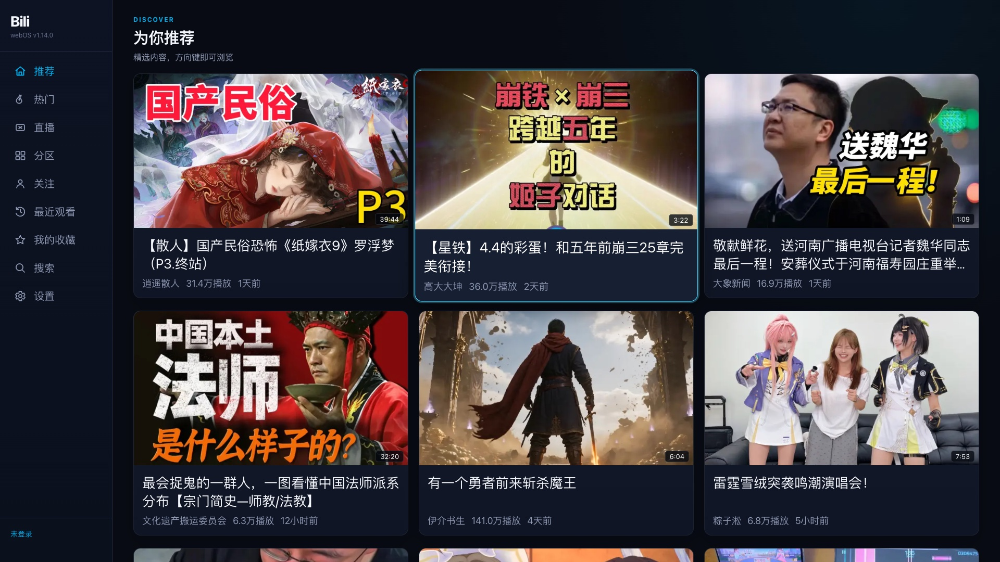
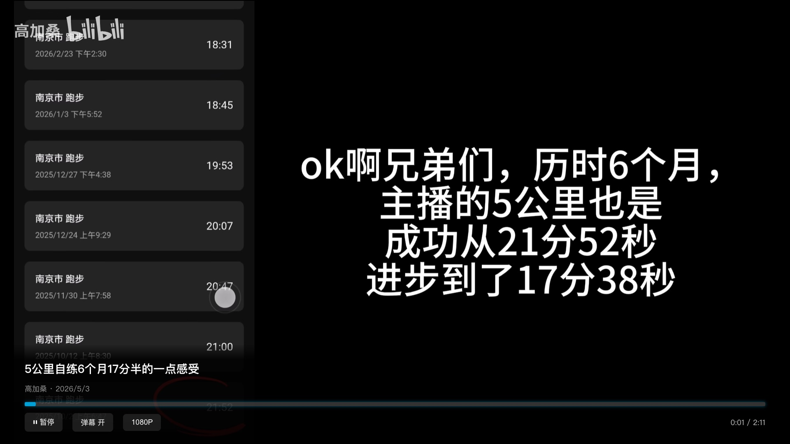
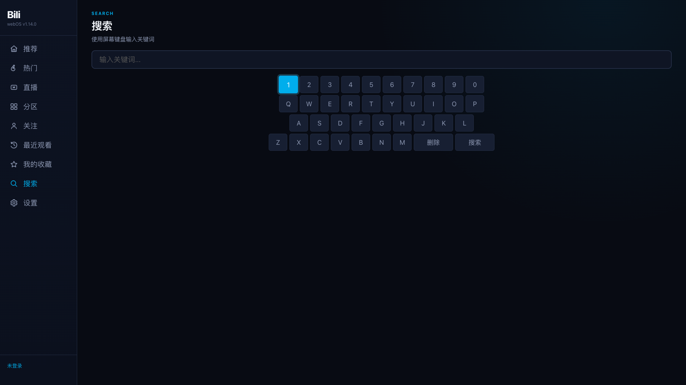
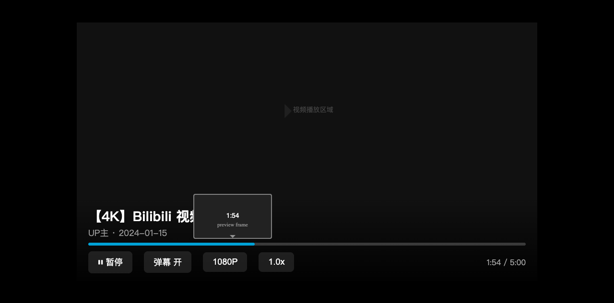

# BiliTV for webOS

A third-party Bilibili client built for LG webOS TVs.


`bili-webos` brings a 10-foot Bilibili experience to the living room with remote-first navigation, QR login, local proxying for TV playback, and a dedicated webOS service for API and media access.

## Highlights

- Remote-first 10-foot UI designed for D-pad navigation and focus management
- Video playback with DASH streams, quality switching, and playback resume
- Live streaming with HTTP-FLV priority and HLS fallback
- QR code login, watch history, favorites, follow feed, and search
- Local webOS service for API access, cookie handling, and CDN proxying
- One-command build and deploy workflow for real TV hardware

## Screenshots

| Home | Player |
| --- | --- |
|  |  |

| Search | Scrub Preview |
| --- | --- |
|  |  |

## Architecture

```text
On TV:
Web App (React) <-> Luna bus <-> JS Service (Node.js) <-> Bilibili API
      |                                             |
      +---------------- HTTP :7654 proxy ----------+
                                                    |
                                                    +-> Bilibili CDN

In local development:
Web App (Vite dev server) -> /proxy -> Bilibili API / CDN
```

## Features

- Browse recommended, hot, partition, follow, and live content
- Play on-demand videos with quality selection and danmaku overlay
- Open live rooms with automatic stream source fallback
- Search with an on-screen keyboard optimized for TVs
- Log in with a mobile QR code
- Sync progress and keep a watch history
- Access favorites and account-related pages from the TV UI

## Tech Stack

- React 19
- Vite 8
- Bun 1.3
- Shaka Player for DASH playback
- `mpegts.js` for HTTP-FLV live playback
- Node.js-based webOS background service
- `ssh2`-powered deployment and remote debugging tools

## Requirements

- LG webOS TV with Developer Mode enabled
- Bun 1.3 or newer
- `@webos-tools/cli` for packaging and device workflows
- TV connection credentials configured in `.env` for deploy/debug tools

## Getting Started

```bash
git clone https://github.com/dotennin/bili-webos.git
cd bili-webos
bun install
bun add -g @webos-tools/cli
```

## Development

```bash
# Start the Vite dev server with the local /proxy bridge
bun run dev

# Build frontend + webOS service
bun run build

# Build, package, and deploy to a TV
bun run build-and-deploy
```

The local dev server runs at [http://localhost:5173](http://localhost:5173) and proxies supported Bilibili API and CDN traffic through `/proxy`.

## TV Tooling

```bash
# Remote debug the running TV app
bun --env-file=.env tools/debug.ts

# Take a screenshot from the TV app
bun --env-file=.env tools/screenshot.ts

# Run the end-to-end API test helper (requires the dev server)
bun tools/test-e2e.ts
```

## Testing

```bash
# Unit tests
bun test

# Coverage report
bun test:coverage

# Formatting + linting
bun format
bun lint

# Type checking
bun run typecheck
```

CI expects coverage above 90% when existing code changes.

## Project Structure

```text
bili-webos/
├── src/                                # React app source
│   ├── api/                            # Bilibili API wrappers and signing
│   ├── components/                     # TV-focused UI building blocks
│   ├── hooks/                          # Focus and keyboard navigation
│   ├── pages/                          # Main app pages
│   ├── player/                         # Video and live player flows
│   └── utils/                          # Shared utilities
├── public/webOSTVjs-1.2.13/           # webOS JS bridge library
├── webos/meta/                         # appinfo.json and app icons
├── webos/service/com.biliwebos.app.service/
│   ├── src/                            # Background service source
│   ├── dist/                           # Built service runtime
│   └── test/                           # Service-side tests
├── tools/                              # Deploy, debug, release, and test helpers
├── docs/screenshots/                   # README screenshots
├── build.sh                            # One-command build and deploy entrypoint
└── package.json                        # Root manifest and scripts
```

## Release Workflow

- Use Conventional Commit messages such as `feat: ...`, `fix: ...`, or `docs: ...`
- `release-please` manages changelog updates, GitHub releases, and version bumps
- Packaging outputs an installable `.ipk` and a release manifest

## License

MIT
