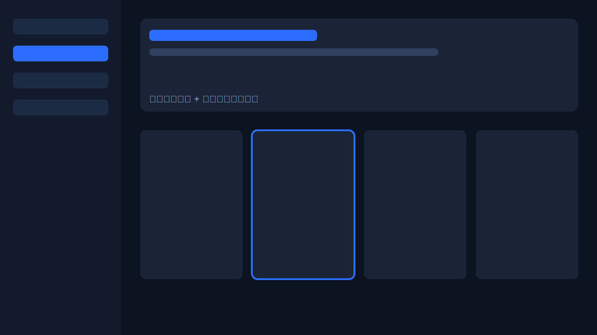
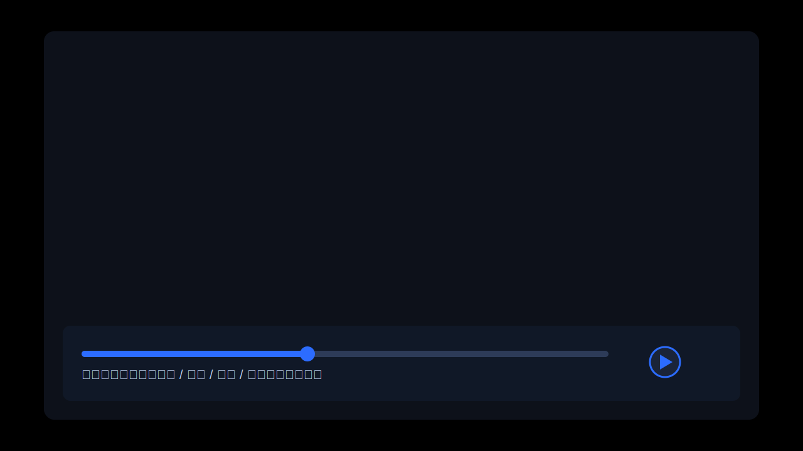
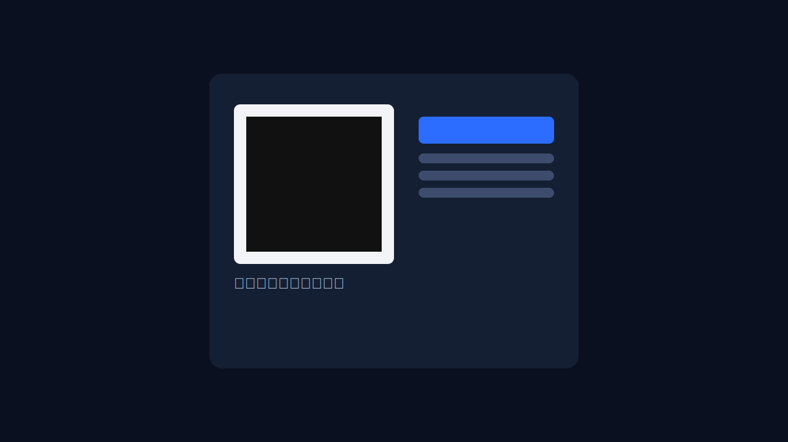

# BiliTV for webOS

LG webOS 智能电视的第三方哔哩哔哩客户端。


## 项目简介

BiliTV for webOS 是一个专为 LG webOS 电视设计的第三方 B 站客户端，目标是把移动端/网页端常用能力迁移到「大屏 + 遥控器」场景：

- **10-foot UI 体验**：针对电视观看距离优化字号、布局和焦点态。
- **遥控器优先交互**：完整的方向键焦点导航、返回栈和快捷操作。
- **播放闭环**：支持 DASH 分段流、多清晰度切换、播放进度同步。
- **账号能力**：扫码登录、历史记录、关注动态、收藏与搜索。

## 界面预览

> 以下为当前版本的界面示意图，用于帮助快速理解信息架构与交互路径。

| 首页 / 视频流 | 播放器控制栏 |
|---|---|
|  |  |

| 扫码登录 |
|---|
|  |


## 功能

- **视频浏览** — 推荐、热门、分区、关注动态
- **视频播放** — DASH 自适应流，360P-8K 画质切换
- **弹幕** — 实时弹幕渲染
- **直播** — 关注的主播直播列表，`FLV` 低延迟优先，`HLS` 自动回退
- **搜索** — 虚拟键盘 + 视频搜索
- **历史记录** — 播放进度上报，续播支持
- **扫码登录** — 手机 B 站扫码

## 架构

```
┌──────────────────────────────────────────┐
│               LG webOS TV                 │
│                                           │
│   Web App (React)  ◀──Luna──▶  JS Service │
│   Chromium 108         bus     Node.js v16 │
│        │                          │        │
│        └──── HTTP :7654 ──────────┘        │
└───────────────────────┬───────────────────┘
                        │ HTTPS
                        ▼
                 Bilibili API / CDN
```

- **Web App**：React 前端，点播使用 Shaka Player，直播按流类型在 `mpegts.js` 和 HLS 之间自动切换
- **JS Service**：TV 后台 Node.js 服务，处理 API 请求（绕过 CORS）、Cookie 管理、视频/图片代理，并重写 HLS 播放列表里的分片 URL
- **零外部依赖**：不需要额外的代理服务器，一个 ipk 包含所有

## 安装

### 前置条件

- LG webOS TV（2020 及以上，推荐 2024 webOS 24）
- 电视开启 [Developer Mode](https://webostv.developer.lge.com/develop/getting-started/developer-mode-app)
- 电脑安装 Node.js 18+, npm

### 步骤

```bash
# 1. 克隆仓库
git clone https://github.com/asdf17128/bili-webos.git
cd bili-webos

# 2. 安装依赖
npm install
cd app && npm install && cd ..

# 3. 安装 webOS CLI（如果没有）
npm install -g @webos-tools/cli

# 4. 配置电视连接（修改 tools/deploy.mjs 中的 IP）

# 5. 一键构建部署
bash build.sh
```

### 开发模式

```bash
# 一键启动开发模式（同时启动 proxy + app dev server）
npm run dev
# 浏览器打开 http://localhost:5173
```

### 测试

```bash
# 运行单元测试（直播流选择 + HLS 播放列表重写）
npm test

# 运行代理联调测试（需要先启动 proxy）
node tools/test-e2e.mjs
```

## 项目结构

```
bili-webos/
├── app/                          # 前端 React 应用
│   ├── src/
│   │   ├── api/                  # B站 API 封装、WBI 签名、直播流选择
│   │   ├── hooks/useFocus.js     # 电视遥控器焦点导航
│   │   ├── components/           # 视频卡片、侧边栏、键盘
│   │   ├── pages/                # 各页面
│   │   ├── player/               # 视频/直播播放器 + 弹幕
│   │   └── utils/                # 工具函数
│   ├── public/webOSTVjs-1.2.13/  # webOS Luna bus 通信库
│   └── webos-meta/               # appinfo.json + 图标
│
├── service/                      # TV 后台服务
│   └── com.biliwebos.app.service/
│       ├── service.js            # API 代理 + 本地 HTTP 服务
│       ├── cast/hlsPlaylist.js   # HLS 播放列表重写，保持分片继续走本地代理
│       └── test/                 # service 侧单元测试
│
├── proxy/                        # 开发用备用代理（含 m3u8 重写）
├── tools/                        # 部署/调试/测试工具
├── build.sh                      # 一键构建部署
├── CLAUDE.md                     # 开发指南
└── DESIGN.md                     # 设计文档
```

## 遥控器操作

### 首页
| 按键 | 功能 |
|------|------|
| 方向键 | 移动焦点 |
| Enter / 点击 | 选择视频 / 切换导航 |
| Back | 返回上级 / 退出 |

### 播放器
| 按键 | 无控制栏 | 有控制栏 |
|------|---------|---------|
| 左/右 | 快退/快进 10s | 切换按钮 |
| 上 | 呼出控制栏 | 关闭控制栏 |
| 下 | 呼出控制栏 | 显示推荐 |
| Enter | 暂停/播放 | 执行按钮 |
| Back | 退出播放 | 关闭控制栏 |

## 技术栈

- **前端**: React 18 + Vite 6
- **视频**: Shaka Player (DASH)
- **直播**: `mpegts.js` (HTTP-FLV) + HLS fallback
- **TV Service**: Node.js v16 (webOS 内置)
- **部署**: ssh2 (绕过 ares-cli 兼容问题)
- **调试**: Chrome DevTools Protocol via SSH

## 开发工具

```bash
node tools/debug.mjs       # 远程调试（console、DOM、性能指标）
node tools/screenshot.mjs   # 远程截图
bash tools/verify.sh        # 构建→部署→验证完整流程
```

## License

MIT
